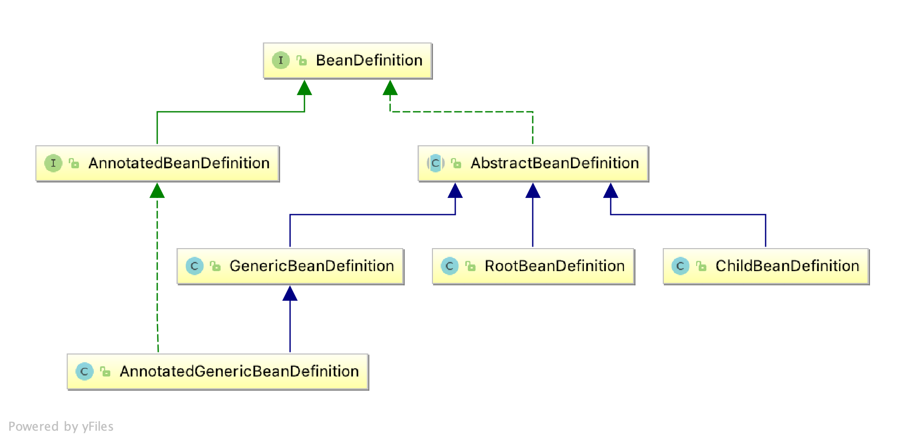
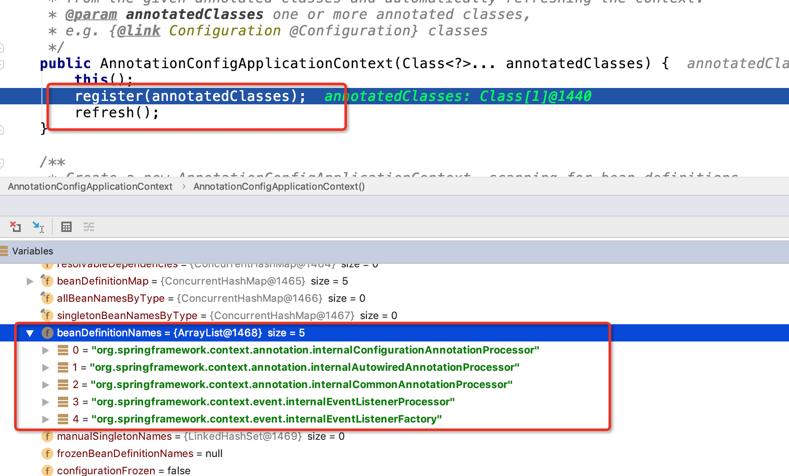
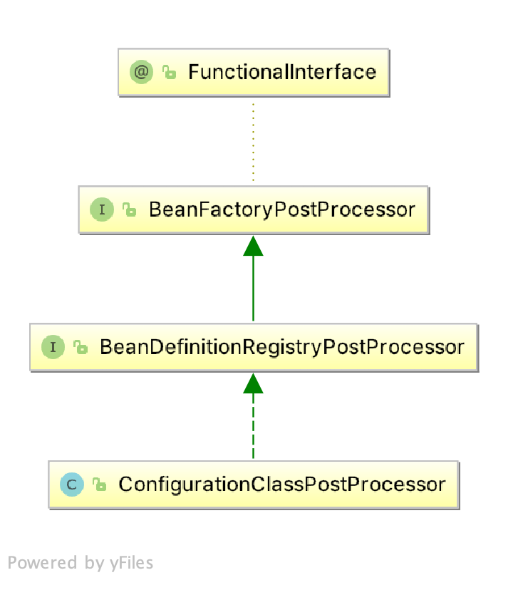
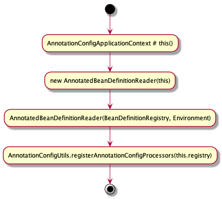

# Spring源码分析
## 深入理解spring Bean生命周期
### 一个简单的注入Bean的example

下面是一个简单的注册Bean的程序
```java
@Configuration
public class LifeCycleExample {

    @Bean
    public ExampleBeanA exampleBeanA() {
        return new ExampleBeanA("ExampleBeanA instance");
    }

    class ExampleBeanA {
        public String name;
        public ExampleBeanA(String name){
            this.name = name;
        }
        @Override
        public String toString() {
            return "ExampleBeanA{" +
                    "name='" + name + '\'' +
                    '}';
        }
    }

    public static void main(String[] args) {

        AnnotationConfigApplicationContext context = new AnnotationConfigApplicationContext(LifeCycleExample.class);

        ExampleBeanA bean = context.getBean(ExampleBeanA.class);

        System.out.println(bean);

    }
```

```
ExampleBeanA{name='ExampleBeanA instance'}
```
上面的代码中，@Bean注解向容器中添加了一个ExampleBeanA的实例。

### Spring基础知识
在翻看源码了解整个注册过程之前我们先了解几个
Spring基础知识。

* Spring使用 BeanDefinition 来描述一个拥有哪些属性，哪些构造方法参数和包括进一步具体实现信息的的bean的实例。
所以 BeanDefinition 这可以说是抽象了Spring Bean的数据结构。我们注册的bean都将经历从 spring 创建相应
的 BeanDefinition 到创建具体的实例。下图描述BeanDefinition的部分继承。



* Spring经典的startup method -- AbstractApplicationContext#refresh

```java
public void refresh() throws BeansException, IllegalStateException {
		synchronized (this.startupShutdownMonitor) {
			// Prepare this context for refreshing.
			prepareRefresh();

			// Tell the subclass to refresh the internal bean factory.
			ConfigurableListableBeanFactory beanFactory = obtainFreshBeanFactory();

			// Prepare the bean factory for use in this context.
			prepareBeanFactory(beanFactory);

			try {
				// Allows post-processing of the bean factory in context subclasses.
				postProcessBeanFactory(beanFactory);

				// Invoke factory processors registered as beans in the context.
				invokeBeanFactoryPostProcessors(beanFactory);

				// Register bean processors that intercept bean creation.
				registerBeanPostProcessors(beanFactory);

				// Initialize message source for this context.
				initMessageSource();

				// Initialize event multicaster for this context.
				initApplicationEventMulticaster();

				// Initialize other special beans in specific context subclasses.
				onRefresh();

				// Check for listener beans and register them.
				registerListeners();

				// Instantiate all remaining (non-lazy-init) singletons.
				finishBeanFactoryInitialization(beanFactory);

				// Last step: publish corresponding event.
				finishRefresh();
			}

			catch (BeansException ex) {
				if (logger.isWarnEnabled()) {
					logger.warn("Exception encountered during context initialization - " +
							"cancelling refresh attempt: " + ex);
				}

				// Destroy already created singletons to avoid dangling resources.
				destroyBeans();

				// Reset 'active' flag.
				cancelRefresh(ex);

				// Propagate exception to caller.
				throw ex;
			}

			finally {
				// Reset common introspection caches in Spring's core, since we
				// might not ever need metadata for singleton beans anymore...
				resetCommonCaches();
			}
		}
	}
```
* Spring内置的BeanPostProcessor
Spring内置了一些很有用的BeanPostProcessor接口实现类。比如有AutowiredAnnotationBeanPostProcessor、
RequiredAnnotationBeanPostProcessor、CommonAnnotationBeanPostProcessor、
EventListenerMethodProcessor等。这些Processor会处理各自的场景。
正是有了这些processor，把bean的构造过程中的一部分功能分配给了这些processor处理，减轻了BeanFactory的负担。
读者现在可以不用了解这些processor的用途，下图中，在调用`register(annotatedClasses)`和`refresh()`方法之前，
已经载入了多个BeanPostProcessor。下面我将向大家描述spring容器启动时候，如何载入某些内置的processor。



> 【注意】不同的`ApplicationContext`内置的`BeanPostProcessor`不同。

针对本章节内容我们主要讲解图片中的`org.springframework.context.annotation.internalConfigurationAnnotationProcessor`
对应的class为`ConfigurationClassPostProcessor`,下面`ConfigurationClassPostProcessor`的部分继承关系。
<div align=center>

</div>

`AnnotationConfigApplicationContext`的构造方法调用链如下,执行结束时候已经向容器中载入`ConfigurationClassPostProcessor`
的`BeanDefinition`,具体代码在`AnnotationConfigUtils.registerAnnotationConfigProcessors(this.registry);`即下图的最后
一个步骤。
<div align=center>

</div>

```java
public static Set<BeanDefinitionHolder> registerAnnotationConfigProcessors(
			BeanDefinitionRegistry registry, @Nullable Object source) {

        ...

		Set<BeanDefinitionHolder> beanDefs = new LinkedHashSet<>(8);

        // org.springframework.context.annotation.internalConfigurationAnnotationProcessor
		if (!registry.containsBeanDefinition(CONFIGURATION_ANNOTATION_PROCESSOR_BEAN_NAME)) {
			RootBeanDefinition def = new RootBeanDefinition(ConfigurationClassPostProcessor.class);
			def.setSource(source);
			beanDefs.add(registerPostProcessor(registry, def, CONFIGURATION_ANNOTATION_PROCESSOR_BEAN_NAME));
		}

        // org.springframework.context.annotation.internalConfigurationBeanNameGenerator
		if (!registry.containsBeanDefinition(AUTOWIRED_ANNOTATION_PROCESSOR_BEAN_NAME)) {
			RootBeanDefinition def = new RootBeanDefinition(AutowiredAnnotationBeanPostProcessor.class);
			def.setSource(source);
			beanDefs.add(registerPostProcessor(registry, def, AUTOWIRED_ANNOTATION_PROCESSOR_BEAN_NAME));
		}

		// Check for JSR-250 support, and if present add the CommonAnnotationBeanPostProcessor.
		// org.springframework.context.annotation.internalCommonAnnotationProcessor
		if (jsr250Present && !registry.containsBeanDefinition(COMMON_ANNOTATION_PROCESSOR_BEAN_NAME)) {
			RootBeanDefinition def = new RootBeanDefinition(CommonAnnotationBeanPostProcessor.class);
			def.setSource(source);
			beanDefs.add(registerPostProcessor(registry, def, COMMON_ANNOTATION_PROCESSOR_BEAN_NAME));
		}

		...

		return beanDefs;
	}
```

到这里读者应该明白为什么在`refresh()`方法执行之前容器中已经载入过多个BeanDefinition，而且这些BeanDefinition大多对应
某个processor，尤其是`ConfigurationClassPostProcessor`对@Bean注解向spring容器注册bean信息起着至关作用的作用。

